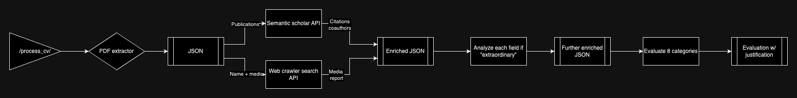

# CV Processor for O1A Visa Evaluation

Workflow

## Purpose

This system processes CVs (Curriculum Vitae) and evaluates them for O1A visa eligibility, focusing on individuals with extraordinary ability in sciences, education, business, or athletics. Our system automates the initial evaluation process, providing data-driven insights into a candidate's qualifications across various categories.

## Target Audience

The primary users of this system are scientific researchers and engineers applying for O1A visas. The evaluation focuses on their publications, media coverage, peer review contributions, and other relevant accomplishments that demonstrate extraordinary ability.

## Workflow

1. **PDF Parsing**: Extract text from the uploaded CV.
2. **Data Enrichment**: Enhance CV data using external sources (e.g., Semantic Scholar API, media searches).
3. **CV Analysis**: Analyze the enriched data to identify and label extraordinary achievements.
4. **O1A Evaluation**: Assess the candidate's qualifications across 8 O1A visa categories.
5. **Report Generation**: Produce a detailed evaluation report and summary with supporting evidence.

## Key Features and Design Considerations

### Data Extraction and Enrichment
- Parse CVs for key information (education, publications, awards, etc.).
- Enrich publication data using Semantic Scholar API for citation counts and venue information.
- Predict research field to establish baselines for citation impact.
- Search major US media outlets for coverage of the candidate's work.

### Metrics and Evaluation
- Focus on metrics that demonstrate being "much better than peers in the same category."
- Compare citation counts to field medians to establish significance.
- Count patents and other non-traditional publications.
- Label extraordinary achievements in each category for final evaluation.
- Metrics and metrics combinations can build a portfolio to support one of the 8 categories.

### O1A Category Assessment
- Evaluate across 8 categories: Awards, Membership, Press, Judging, Original contribution, Scholarly articles, Critical employment, High remuneration, by metrics and combinations from the previous step.
- Provide a rating (low, medium, high) with supporting data and justification for each category.
- Emphasize the need for strong evidence in at least 3 categories.

### LLM Integration
- Use LLM knowledge to assess the extraordinariness of awards, memberships, and education.
- Employ LLM for final category evaluations, ensuring use of only provided data to avoid bias or hallucination.

### Report Generation
- Create detailed JSON output with evaluation results and supporting data.
- Generate a markdown summary highlighting key findings and category ratings.

## API Usage

The system exposes a FastAPI endpoint for CV processing:

- **Endpoint**: `/process_cv/`
- **Method**: POST
- **Input**: PDF file (multipart/form-data)
- **Output**: JSON containing O1A evaluation results with supporting evidence

## Interpreting the Output JSON

See `examples/` for the input and output.

The CV Processor generates a comprehensive JSON file containing the evaluation results. Here's a guide to understanding its structure:

### Top-level Structure

1. `raw_data`: Contains all the extracted and enriched information from the CV.
2. `o1a_evaluation`: Holds the detailed evaluation for each O1A category.
3. `qualifying_achievements`: A list of key achievements supporting the O1A application.
4. `overall_rating`: A summary rating of the applicant's qualification for O1A visa.
5. `insights`: A detailed analysis of the applicant's qualifications and achievements.
6. `markdown_summary`: A formatted summary of the evaluation, suitable for quick review.

### Raw Data

The `raw_data` section includes:

- Basic information (name, email)
- Education history
- Awards and honors
- Academic memberships
- Publications with citation counts
- Patents, licenses, and copyrights
- Employment history
- Media coverage
- Predicted research fields

### O1A Evaluation

The `o1a_evaluation` section provides:

- Ratings for each of the 8 O1A categories:
  1. Awards
  2. Membership
  3. Press
  4. Judging
  5. Original contribution
  6. Scholarly articles
  7. Critical employment
  8. High remuneration

For each category, you'll find:
- A rating (high, medium, or low)
- Justification for the rating
- Information used in the evaluation
- Information not used (to ensure transparency)

### Qualifying Achievements

This section lists key accomplishments that support the O1A application, serving as a quick reference for standout qualifications.

### Overall Rating

A single word (high, medium, or low) summarizing the applicant's overall qualification for the O1A visa.

### Insights

A detailed narrative analysis of the applicant's qualifications, providing context and highlighting the most significant aspects of their career and achievements.

### Markdown Summary

A formatted summary of the entire evaluation, including:
- Applicant information
- Education details
- Overall O1A qualification rating
- List of qualifying achievements
- Detailed category evaluations
- Insights and analysis

## Using the Output

1. **Quick Assessment**: Refer to the `overall_rating` and `qualifying_achievements` for a rapid evaluation of the applicant's suitability. Personas: applicant and attorney

2. **Detailed Review**: Examine the `o1a_evaluation` section for in-depth analysis of each category. Personas: applicant and attorney. 

3. **Supporting Documentation**: Use the `insights` and `markdown_summary` sections to draft support letters or prepare application materials. Personas: attorney

4. **Identifying Strengths and Weaknesses**: Review individual category ratings to identify areas where the application is strongest and where it might need additional support. Personas: applicant.

5. **Data Verification**: Cross-reference the `raw_data` section with the original CV to ensure accuracy and completeness. Personas: applicant and attorney.

By thoroughly reviewing each section of the output JSON, users can gain a comprehensive understanding of the applicant's qualifications and make informed decisions regarding their O1A visa application.

## Future Improvements

1. Enhance data enrichment with more accurate citation count searches and validation.
2. Incorporate actual median citation count data for research fields instead of LLM estimates.
3. Improve handling of non-traditional publications (e.g., textbooks, patents).
4. Expand media coverage search to include more major US outlets.
5. Implement additional metrics like recent citations (within X years) and citations by high-impact papers.

## Evaluation Criteria

- Align assessments with typical profiles of researchers and engineers in the target audience.
- Compare key metrics (e.g., citation count, publication count) to field medians to identify significant achievements.
- Validate media coverage to ensure explicit mention of the candidate's major contributions.
- Provide clear, evidence-based justifications for each category rating to support the O1A application process.

## Conclusion

This CV Processor offers a data-driven, unbiased initial screening for O1A visa applications. By combining thorough data extraction, enrichment, and analysis, it provides valuable insights into a candidate's extraordinary abilities and achievements, streamlining the evaluation process for both applicants and reviewers.
